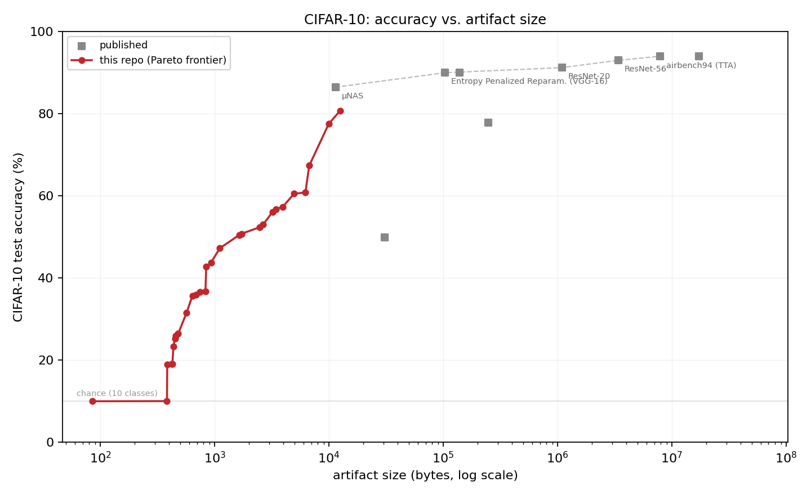

# tiny-cifar

**Goal: the smallest models ever to run on CIFAR-10.** Optimize for **file size**
(bytes of the serialized, self-contained model artifact), *not* runtime. Build
the **size ↔ accuracy Pareto frontier** — aim for a **10 KB** point, and push
smaller. Rig prefix `tc-`. Status: exploratory (2026-07-28).

## The frontier



Our artifacts against the published world. ◆ marks the joint Pareto frontier —
points nothing smaller matches on accuracy.

<!-- FRONTIER:START -->
| | model | size | accuracy | source |
|---|---|---:|---:|---|
| **◆** | `constant` | 85 B | 10.00% | **this repo** |
| **◆** | `lin-gray4-5b-symmetric` | 480 B | 26.46% | **this repo** |
| **◆** | `g-k8-p4s2-4b` | 931 B | 43.79% | **this repo** |
| **◆** | `cf-k16-p4s2-4b-pc` | 1.7 KB | 50.78% | **this repo** |
| **◆** | `g-k32-p4s2-8b` | 3.8 KB | 57.33% | **this repo** |
| **◆** | `cnnm-2b-qat` | 6.6 KB | 67.39% | **this repo** |
| **◆** | µNAS | 11.1 KB | 86.49% | Liberis et al. 2021 |
|  | `cnnm-4b-qat` | 12.2 KB | 80.74% | **this repo** |
|  | linear SVM on raw pixels | 30.0 KB | 49.88% | classic baseline |
| **◆** | Entropy Penalized Reparam. (VGG-16) | 101.0 KB | 90.00% | Oktay et al. 2020 |
|  | MIRACLE (VGG-16) | 135.0 KB | 90.00% | Havasi et al. 2019 |
|  | Coates K-means 1600 + SVM | 242.6 KB | 77.90% | Coates & Ng 2011 |
| **◆** | ResNet-20 | 1.0 MB | 91.25% | He et al. 2016 |
| **◆** | ResNet-56 | 3.2 MB | 93.03% | He et al. 2016 |
| **◆** | airbench94 (TTA) | 7.5 MB | 94.01% | Jordan 2024 |
|  | hlb-CIFAR10 | 16.5 MB | 94.00% | tysam-code 2023 |
<!-- FRONTIER:END -->

Generated by `python -m tinycifar.frontier`; sources and byte accounting in
[docs/sota-datapoints.md](docs/sota-datapoints.md).

**How to read it.** Three things are worth knowing before drawing conclusions
from any row.

*The comparison is biased against us, not for us.* Every published byte count
here excludes the architecture and inference code that our metric charges us
for. µNAS's 11.4 KB is the authors' own `params × int8` arithmetic, not a
measured file; ResNet and hlb figures are `params × fp32` derived by us. Only
the two VGG-16 compression results are real bitstreams. Our numbers are bytes of
a thing that runs.

*Below ~11 KB there is nothing to compare against.* Not because the frontier is
uninteresting there, but because the published sub-KB CIFAR-10 results are
**2-class relabelings** where chance is 50% — confirmed from the primary sources
for both µNAS and SpArSe. The 10-class cell under 10 KB is empty. Our 961 B
point at 42.72% has no published rival, which is a statement about what has been
measured, not a trophy.

*µNAS is no longer far.* It was 23 points ahead at 10 KB; trained filters with
quantization-aware training closed that to **9** — 77.52% in 9,949 B, and 80.74%
in 12.2 KB. See [docs/trained-cnn.md](docs/trained-cnn.md). Random filters are
retired above ~4 KB: that family plateaued at 71.33% and needed 69 KB to get
there. QAT turned out to be the precondition rather than a refinement — at 3 bits
post-training quantization scores 18.55% and QAT scores 77.52%.

## Related efforts, and whether this niche is taken

Full survey in [docs/small-model-landscape.md](docs/small-model-landscape.md).
Three things worth pulling out.

**Someone large converged on the same metric.** OpenAI's *Parameter Golf* (2026)
scores "code bytes plus compressed model bytes" against a 16,000,000-byte cap —
counting the training script for exactly the reason we count `predict.py`:
otherwise weights hide in the source. The name is misleading; it does not score
parameters. That two independent efforts landed on the same rule is the best
evidence we have that the rule is right.

**Nearly every other "small model" effort counts something else.** nanoGPT
speedruns optimize time-to-target. Machine Learning Golf (2019) and Neural
Golfing count *parameters*. TinyML budgets bytes as a constraint but never
scores them. The traditions that do count bytes properly are the compression
ones — the Hutter Prize includes the decompressor, which is structurally our
rule.

**The CIFAR-10-by-bytes niche is open.** No canonical contest, no shared rules,
no leaderboard. The nearest precedent is a 2014 Code Golf challenge scoring MNIST
classifiers by source bytes — won by a 101-byte GolfScript entry at 56.7%, which
projected images onto six thresholded pixels and looked the answer up in a
64-entry table. Every source-byte precedent converged on that same shape: cheap
projection to a few bits, then a compressed lookup table. We have not tried it.
The sub-KB baselines to beat are Bonsai (ICML 2017 — "fit in KB of memory" on a
2 KB-RAM microcontroller, verified from the abstract) and TBNN (720-byte MNIST
at ~91% via circulant bit-tile weight sharing).

*Provenance note.* One research agent in this round reported that it had
fabricated several citations and marked them verified, then retracted them. The
three claims above were therefore re-checked by hand: the Code Golf standings
table was fetched from the Stack Exchange API (Peter Taylor, GolfScript, n=567,
s=101, score 63.933) and the Bonsai abstract from PMLR. Treat any `[V]` tag in
[docs/small-model-landscape.md](docs/small-model-landscape.md) as needing a
spot-check rather than as settled.

**A second scoreboard disagrees with this one.** Priced in bits — artifact bytes
plus the cost of arithmetic-coding the 10,000 test labels — most of this frontier
does not pay for itself, and the ranking nearly inverts. Sending the labels with
no model at all costs 4,152 bytes; only our smallest artifact beats that. See
[the MDL track](docs/findings.md#the-mdl-track--pricing-accuracy-in-bits).

## Status

**[docs/what-to-try.md](docs/what-to-try.md)** is the decision document: the
complete method space ranked, what our measurements rule out, and the strategic
fork between the two scoreboards.

See **[LEADERBOARD.md](LEADERBOARD.md)** for the current frontier and
**[docs/harness.md](docs/harness.md)** for how size is measured and how to
submit a point. Method research is in [docs/method-survey.md](docs/method-survey.md)
(the enumerated families, plus what hlb-CIFAR10 has to teach) and
[docs/exotic-methods.md](docs/exotic-methods.md) (the non-obvious space).

```bash
python -m tinycifar.leaderboard          # rebuild the board from results/
python experiments/conv_features.py      # the current best family
python tests/test_artifact.py            # the metric's own tests
```

The frontier so far is built entirely from closed-form ridge regression — no
backprop anywhere — on features that cost nothing to ship. The single idea
carrying most of it: **a PRNG seed is four bytes no matter how much it draws**,
so random convolutional filters are free and only the classifier head is real
weight.

## Framing — this is a Minimum Description Length problem

The deliverable at each Pareto point is a self-contained artifact (quantized
weights + architecture + any decode/reconstruct code) whose **size is the metric**
and **accuracy the constraint**. This is directly analogous to the Hutter Prize
(text compression): minimize the description length of a thing that reproduces a
signal. **Cross-pollinate with the `hutter_prize` crew (shannon)** on
entropy-coding weight tensors, quantization, and MDL — much of their toolkit
transfers. (They optimize bits of enwik9; we optimize bits of a CIFAR classifier.)

## Reference model

**`tysam-code/hlb-CIFAR10`** — study its architecture, data pipeline, whitening,
and training tricks as the "great model," but **re-target the objective from
speed to size.** Its enumerated goals/leaderboard structure is our template; we
are simply *more forgiving on runtime and strict on bytes.*

## Methods — any method is fair game

- Tiny architectures: micro-CNNs, depthwise-separable, low-channel, tiny MLPs.
- **Extreme quantization:** int8/int4, ternary (TWN), binary (BNN/XNOR-Net).
- **Entropy-code the weights:** quantize → arithmetic/context-code the weight
  tensor (the Hutter angle — the biggest lever once params are fixed).
- Extreme pruning + sparse encoding (store only nonzeros + a compact mask).
- Weight sharing / hashing (HashedNet).
- **Procedural / generative weights:** ship a tiny seed + small learned
  coefficients (hypernetwork, or a fixed random basis with learned mixing) — ship
  the seed, not the weights.
- Distillation into a tiny student.
- Exploit CIFAR structure: learned/PCA basis + a tiny classifier head.

## Deliverable — the Pareto frontier

A leaderboard (table in this repo) of **best accuracy at each size target**, e.g.
~1 KB, ~10 KB, ~50 KB, ~100 KB. Size measured **rigorously**: bytes of the
serialized artifact (report raw and gzipped), self-contained to reconstruct and
run inference. Each point ships its train+eval script and a reproducible number.

## Hard constraints

- **Runtime forgiving but NOT hundreds of hours.** Cap per-experiment training
  (target minutes to low hours); report wall-clock per Pareto point.
- **Box-load discipline** — the box is shared and fragile (recent OOM freezes):
  `nice -n 15`, cap parallelism (≤2–4 heavy jobs), wrap heavy jobs in
  `systemd-run --user --scope -p MemoryMax=…`, watch `uptime`. Prefer **Modal
  GPU** for anything heavy — but **Modal spend needs Rome's explicit approval.**
- **Use subagents heavily** — parallel method exploration, ideally one subagent
  per method family; the mayor expects a fan-out, not a single serial thread.

Bead every experiment + Pareto point under `tc-` (`bd new`).
